<p align="center">
  
</p>

<p align="center">
  &nbsp;
  &nbsp;
  &nbsp;
  <a href="https://github.com/alonbaron"></a>
</p>

<p align="center">
  <b>Six Claude Code skills tuned to one engineering style: model-first, failure-path-aware, YAGNI.</b><br>
  <sub>One install. Usable in the Claude Code CLI and the VS Code / JetBrains extensions.</sub>
</p>

---

## ◢ Install

```text
/plugin marketplace add alonbaron/claude-skills
/plugin install alon-skills@alonbaron
```

Pull updates anytime with `/plugin marketplace update alonbaron`. No version is pinned, so every push is the latest.

---

## ◢ The skills

| Skill | Invoke | What it does |
|---|---|---|
| **architect** | `/architect` | Production-grade design docs *before* code — domain model + invariants → failure-path design → API contracts → a sequenced workstream. |
| **review-swarm** | `/review-swarm` | Parallel specialist reviewers (correctness, security, perf, altitude, simplicity, tests) → adversarial verification → a ranked, `file:line` report. |
| **ask-the-council** | `/ask-the-council` | A panel of advisors forced to disagree, then a Chairman who **commits** to one recommendation with the tradeoff named. |
| **prompt-generator** | `/prompt-generator` | Vague ask → rigorous prompt. Anti-hallucination, anti-tokenmaxing, strict agent rules baked in. |
| **up-to-date** | `/up-to-date` | Preflight repo sync + situational brief before you start. Read-only by default — never touches a dirty tree without your OK. |
| **ponytail** | `/ponytail` | Lazy-senior-dev mode: the simplest thing that actually works. *(MIT, vendored — see License.)* |

Each skill also triggers from plain language — e.g. *"spec this out before we build"*, *"swarm review this diff"*, *"ask the council whether…"*, *"catch me up on the repo"*, *"be lazy here"*.

---

## ◢ What they share

- **Lead with the answer.** Output budgets, no filler, no restating the question.
- **Verify or say "I don't know".** No invented files, APIs, or facts.
- **Read before you edit.** Small, reversible changes over rewrites.
- **Design the failure paths** as deliberately as the happy ones; enforce rules at the core.
- **Question whether the code needs to exist at all** before writing it.

---

## ◢ Manage

```text
/plugin list                            # what's installed
/plugin disable alon-skills@alonbaron   # turn off without uninstalling
/plugin uninstall alon-skills@alonbaron
```

---

## ◢ License

MIT — see [LICENSE](LICENSE). The **ponytail** skill is third-party (MIT, © Dietrich Gebert), redistributed unmodified with attribution from [DietrichGebert/ponytail](https://github.com/DietrichGebert/ponytail).

<p align="center">
  <sub>Built by <a href="https://github.com/alonbaron">@alonbaron</a> · <b>Build the model. Define the rules. Then write the code.</b></sub>
</p>
