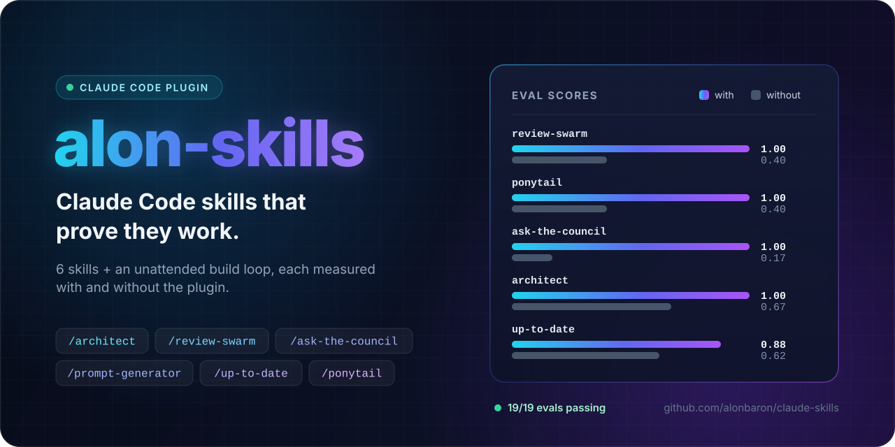

<p align="center">
  
</p>

<p align="center">
  &nbsp;
  &nbsp;
  &nbsp;
  &nbsp;
  <a href="https://github.com/alonbaron"></a>
</p>

<p align="center">
  <b>Six Claude Code skills and one unattended build loop, tuned to one engineering style: model-first, failure-path-aware, YAGNI.</b><br>
  <sub>One install. Usable in the Claude Code CLI and the VS Code / JetBrains extensions.</sub>
</p>

---

## ◢ Install

```text
/plugin marketplace add alonbaron/claude-skills
/plugin install alon-skills@alonbaron
```

Pull updates anytime with `/plugin marketplace update alonbaron` — the marketplace tracks `main`, so you're always on the latest. Tagged releases like [`v3.0.0`](https://github.com/alonbaron/claude-skills/releases) mark the milestones.

---

## ◢ The skills

| Skill | Invoke | What it does |
|---|---|---|
| **architect** | `/architect` | Design docs *before* code — domain model + invariants → failure-path design → API contracts → a sequenced workstream. `architect audit` checks existing docs against the code. |
| **review-swarm** | `/review-swarm` | Six parallel specialist reviewers on Sonnet → Opus verifiers that try to refute each finding → a ranked, `file:line` report. Never edits. |
| **ask-the-council** | `/ask-the-council` | Four (or six) Opus advisors forced to disagree, then a Chairman in the main thread who **commits** to one recommendation with the tradeoff named. |
| **prompt-generator** | `/prompt-generator` | Vague ask → rigorous prompt. Anti-hallucination, anti-tokenmaxing, strict agent rules baked into the prompt itself. |
| **up-to-date** | `/up-to-date` | Preflight repo sync + situational brief before you start. Read-only by default — never touches a dirty tree without your OK. |
| **ponytail** | `/ponytail` | Lazy-senior-dev mode: the simplest thing that actually works. *(MIT, vendored — see License.)* |

Each skill also triggers from plain language — e.g. *"spec this out before we build"*, *"swarm review this diff"*, *"ask the council whether…"*, *"catch me up on the repo"*, *"be lazy here"*.

**Proactive by default.** The skills fire on task *shape*, not just keywords: starting a new feature invokes **architect**, opening work in a repo with a remote invokes **up-to-date**, finishing a non-trivial implementation invokes **review-swarm**, a solution growing past the minimum invokes **ponytail** — announced in one line, no permission asked. Each skill carries a "when not to use" boundary so it stays out of the way on trivial work.

### Trigger map

| Skill | Fires on | Stays quiet on |
|---|---|---|
| architect | a new app, feature, or workstream with no design docs; "architect", "design doc", "spec this out", "roadmap", "audit the docs" | a small fix already covered by current docs; pure implementation of a designed phase |
| review-swarm | "review / check / assess this diff, branch, PR"; a non-trivial implementation just finished | a trivial diff (docs, rename, one-liner); "fix it" asks; security-only asks (`/security-review`); `/code-review` named explicitly |
| ask-the-council | high-stakes, expensive-to-reverse decisions with competing options; "ask the council", "get a panel" | fact-finding; one-obvious-answer calls; anything reversible in an afternoon |
| prompt-generator | a prompt, task spec, or "have it do X" destined for another agent or LLM; "write a prompt", "improve this prompt" | text a human will read; work you'll do yourself this session |
| up-to-date | work about to start in a repo with a remote; "up-to-date", "sync first", "pull latest", "catch me up" | a repo with no remote (one line, then start); a mid-task re-check |
| ponytail | a solution outgrowing the minimum: one-caller abstractions, a dependency for a few lines, scaffolding "for later"; "ponytail", "be lazy", "yagni", "do less" | trust boundaries; the full version explicitly asked; tidying an already-written diff (`/simplify`) |

---

## ◢ The build loop

`/alon-skills:build-loop` builds `TODO_WORKFLOW.md` rows one at a time without supervision, in any repo that carries the architect doc set. Each stage is a fresh subagent with an empty context; state between runs lives in the repo, never in chat.

| Stage | Model | Reads | Writes | Returns | Stops the loop when |
|---|---|---|---|---|---|
| plan | opus, effort high | `TODO_WORKFLOW.md`, git status/branch/log, the `## Commands` table in `CLAUDE.md`, `<scratch>/<id>/plan.json` of a stale row | TODO row → `[IN PROGRESS]` (commit), the branch, `plan.json` | taskId, taskRow, branch, baseCommit, docsToRead, leftForThisTask, commands, resuming, stopReason, staleBlocked | dirty tree; `TODO_WORKFLOW.md` or `SOURCE_OF_TRUTH.md` missing; no `## Commands` table and no single root manifest; no eligible row (names the first two rejected); a stale `[IN PROGRESS]` row it cannot safely resume (closed `[BLOCKED]` for a human) |
| scout | haiku, low | grep/glob excerpts, doc headings | nothing | files with scope, tests, docSections, notes | returns nothing → row back to `[ ]` with a note |
| spec | opus, high | SoT sections, the scout's locations, existing `spec.md` when resuming | SoT → Roadmap → NN docs (committed when a fact changes), `<scratch>/<id>/spec.md` (8 sections, incl. acceptance criteria and unverified APIs) | specPath, docsChanged, unverifiedApis, verifyCommands, stopReason | a missing decision it refuses to guess → row back to `[ ]` with the decision named |
| research | sonnet, medium; skipped when unverifiedApis is empty | manifests, type definitions, context7 | `research.md` | researchPath, unverifiedRemaining | never |
| build | sonnet | `spec.md`, `research.md`, the files the spec names | code + tests, micro-commits, `build.md` | ok, commits, testsPassed, lintPassed, deviations, blockedReason | blockedReason or not ok → `[BLOCKED]`; budget below the build-to-close tail (only when the session set a token target) |
| measure | haiku, low; independent of the builder | `git diff --stat` and `--name-only` base..HEAD | nothing | filesChanged, linesChanged, docsOnly, touchesTrustBoundary, trustPaths, languages | never (a missing result assumes a trust boundary, so the security lens runs) |
| refute | correctness + acceptance on sonnet; invariants on opus; security on sonnet only when a trust-boundary path changed; adversary on sonnet round 1 only, skipped under 30 changed lines or docs-only (writes one breaking test, keeps it uncommitted only if it fails); critic on opus round 1 only (spec vs the TODO row) | `spec.md`, `build.md`, the diff, the SoT invariants, the commands | nothing except the adversary's test file | per lens: verdict, testsRan, blocking, advisory | all lenses return nothing → `[BLOCKED]` |
| merge (script) | — | the lens votes | — | a cited `file:line` finding always blocks; an uncited `fail` counts as a vote and blocks only when two or more lenses agree; rounds 2+ run only correctness, acceptance, invariants | — |
| arbiter | opus; only when a finding the fixer disputed comes back | the finding, the dispute, the diff | nothing | upheld or dismissed per finding, with a reason | never |
| fix | opus, high; at most `maxFixRounds` (default 2) | the blocking findings, `spec.md` | fixes + tests, commits (adopts the adversary's test) | fixed, notFixed (key + reason), commits | blocking findings still standing after the last round → `[BLOCKED]` |
| close | sonnet, low; the only writer of `TODO_WORKFLOW.md` and `docs/handoff.md`; runs on every exit after plan succeeded | `build.md`, `spec.md` §1 and §8, the outcome | the row's status and `Left for <id>: …` note, a newest-first `docs/handoff.md` entry, one commit | ok, commit | — |

The only stop that means "run again" is `reached maxTasks`. Everything else means a human should look at `TODO_WORKFLOW.md` and `docs/handoff.md`.

**In a session:**

```text
/alon-skills:build-loop            # up to 3 tasks
/alon-skills:build-loop 1          # one task
/alon-skills:build-loop 2.1        # that row
/alon-skills:build-loop {"maxTasks":1,"models":{"plan":"fable","spec":"fable"},"skipLenses":["adversary"]}
```

Args and defaults: `maxTasks` 3 · `task` null · `models` {} (per-stage overrides: plan, scout, spec, research, build, measure, refute, invariants, critic, arbiter, fix, close) · `dryRun` false · `maxFixRounds` 2 · `skipLenses` [] · `scratch` `.claude/scratch/build-loop`.

**Unattended, one fresh process per task:**

```text
node <plugin-root>/scripts/autobuild.mjs --tasks 5 [--task 2.1] [--dry-run] [--repo <path>] [--config <path>] [--plugin-dir <path>]
```

The driver runs `claude -p` with `--permission-mode auto` once per task, asks it to run the workflow with `maxTasks: 1`, parses the JSON it returns, and stops on anything but `reached maxTasks`, on a non-zero exit, or on a usage-limit reply. `--config` defaults to `<repo>/.claude/build-loop.json` and is merged into the workflow args, so per-repo model overrides live there. A lock file under `<repo>/.claude/scratch/build-loop/` stops two drivers from running on the same tree; the log is `autobuild.log` next to it. While a session runs, each stage is printed as it starts and finishes when Claude Code's workflow journal is where the driver expects it; that layout is internal, so the driver goes quiet rather than failing when it is not.

**What the repo needs** (the architect skill's templates carry all of it): `TODO_WORKFLOW.md` rows of `# | Task | Architecture Ref | Status | Branch` with the five status strings, `SOURCE_OF_TRUTH.md`, a `## Commands` table in `CLAUDE.md` (Scope | Install | Test | Lint | Format; the loop never guesses a package manager or a test command), and the `Left for <id>: …` note convention. `docs/handoff.md` is created on the first close.

---

## ◢ Evals

`evals/` is a [`claude plugin eval`](https://code.claude.com/docs/en/plugin-evals) suite: 16 behavioral cases, three per skill (four for ponytail), each with a skill-fired grader, a PASS/FAIL rubric on the result, and a process grader wherever the behavior is a tool fact (which model a subagent was spawned with, that no file was edited). Fixtures are real git repos built by `fixture.sh` scaffolds.

```text
claude plugin eval <absolute path to this repo> --runs 2 -j 4 --allow-tools Write Edit --scaffold --model claude-fable-5-1 --judge-model sonnet --no-publish --trust-plugin --threshold 0.7 --json
```

{{EVAL_NUMBERS}}

---

## ◢ Living with Claude Code's built-ins

A skill that fires when a built-in should have, or stays quiet because a built-in got there first, is a bug even when both are good on their own. The overlaps are settled inside the descriptions, so the choice gets made at trigger time instead of after you already have the wrong answer.

| Overlap | Who wins | Why |
|---|---|---|
| **ponytail** vs `/simplify` | split | ponytail governs what gets *built*, before and while you write it. `/simplify` cleans a diff that already exists. |
| **review-swarm** vs `/code-review` | review-swarm | It's the default for a real diff. `/code-review` takes over when you name it, or for a one-liner not worth a swarm. |
| **review-swarm** vs `/security-review` | depends on the ask | Security is one of the swarm's six lenses. When security is the whole question, `/security-review` goes deeper. |

If you also run a UX skill or a prose skill, two hand-offs are worth wiring: review-swarm passes UI and accessibility hunks to the design reviewer instead of guessing at them, and architect's executive summaries are prose worth humanizing. Its tables, invariants, and API contracts are not.

---

## ◢ Companion skills

Not shipped here and not mine. Two third-party skills the hand-offs above are written against, if you want somewhere for them to go. Install them separately.

| Skill | Source | Pairs with |
|---|---|---|
| **ux-designer** | [szilu/ux-designer-skill](https://github.com/szilu/ux-designer-skill) (MIT) | review-swarm, which passes UI and accessibility hunks to it |
| **humanizer** | [blader/humanizer](https://github.com/blader/humanizer) (MIT) | architect, for executive summaries and README prose |

One catch worth knowing about humanizer: as of v2.9.1 the plugin puts `SKILL.md` at its root instead of `skills/humanizer/SKILL.md`. Claude Code installs it, reports it enabled, and never loads it. Copy `SKILL.md` out of `~/.claude/plugins/cache/humanizer/humanizer/<version>/` into `~/.claude/skills/humanizer/` and it works.

---

## ◢ What's new in v3

{{V3_PROSE}}

- Every `SKILL.md` was rewritten for Claude Fable 5.1: judgment rules with the reason attached, instead of numbered procedures the model no longer needs. Frontmatter splits `description` (what it does) from `when_to_use` (when it fires and when it stays quiet), and the combined length stays under the listing's truncation limit.
- The skills now spawn with explicit models: review-swarm reviewers on Sonnet and verifiers on Opus, council advisors on Opus. Naming the model in the spawn makes the behavior the same on every install, whatever the local subagent default is.
- `effort: max` is pinned on architect, ask-the-council, and review-swarm, the three judgment-heavy skills.
- review-swarm and up-to-date pre-approve the read-only git and gh commands they always run, and review-swarm has editing tools switched off for the duration of the review.
- Context injection: up-to-date runs its whole git and GitHub block before the model reads the skill and reasons over the output; review-swarm sees the working tree's status and diff shape; architect sees which design docs exist, so create-vs-audit mode is known before the first tool call.
- The shared "global rules" block is gone from every skill. One portable line replaces it (verify or say you don't know; commits are the repo owner's alone), because installers without a CLAUDE.md still need those two rules.
- The architect templates gained what the build loop reads: a `## Commands` table in `CLAUDE.md`, the `Left for <id>` note convention, and `docs/handoff.md`.
- New: `workflows/build-loop.js` and `scripts/autobuild.mjs` (above), and the `evals/` suite.

---

## ◢ What they share

- **Lead with the answer.** Output budgets, no filler, no restating the question.
- **Verify or say "I don't know".** No invented files, APIs, or facts.
- **Read before you edit.** Small, reversible changes over rewrites.
- **Design the failure paths** as deliberately as the happy ones; enforce rules at the core.
- **Question whether the code needs to exist at all** before writing it.

---

## ◢ Manage

```text
/plugin list                            # what's installed
/plugin disable alon-skills@alonbaron   # turn off without uninstalling
/plugin uninstall alon-skills@alonbaron
```

---

## ◢ License

MIT — see [LICENSE](LICENSE). The **ponytail** skill is vendored from the third-party [DietrichGebert/ponytail](https://github.com/DietrichGebert/ponytail) (MIT, © Dietrich Gebert) and redistributed under the same terms; third-party attribution is recorded in [NOTICE](NOTICE).

<p align="center">
  <sub>Built by <a href="https://github.com/alonbaron">@alonbaron</a> · <b>Build the model. Define the rules. Then write the code.</b></sub>
</p>
